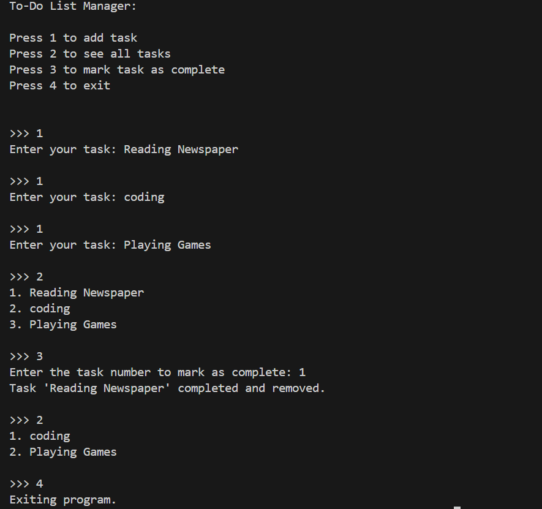

# To-Do List Manager

A simple command-line To-Do List Manager written in C. This program allows users to add tasks, view all tasks, and mark tasks as complete.




## Features

- Add a new task
- Display all tasks
- Mark a task as complete
- Exit the program

## Requirements

- C compiler (GCC or similar)

## Usage

1. Clone the repository or download the `main.c` file.
2. Compile the program using the following command:
   ```
   gcc main.c -o todo
    ```
3. Run the program.
    ```
    ./todo
    ```

## Menu Options
Press 1 to add a task
Press 2 to see all tasks
Press 3 to mark a task as complete
Press 4 to exit

## Code Structure
main.c: Contains the implementation of the To-Do List Manager, including task management functions.

## License
This project is open-source.

# Author 
Arpan Saha